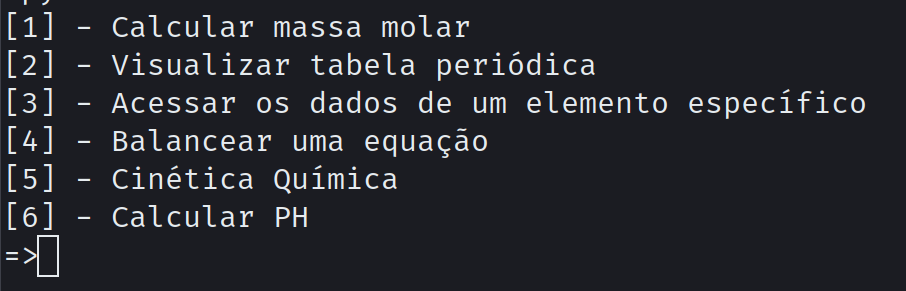

<h1 align="center">Calculadora Físico Química</h1>

<h4 align="center"> 
	👨‍💻 Em construção  👨‍💻
</h4>

<h1 align="center">
    
</h1>

 <a href="#Tecnologias">Tecnologias</a> •
 <a href="https://github.com/RafaelSoares12">Autor</a>

## Tecnologias

Tecnologias usadas:

- Python 3.10

Feito por Rafael Soares

